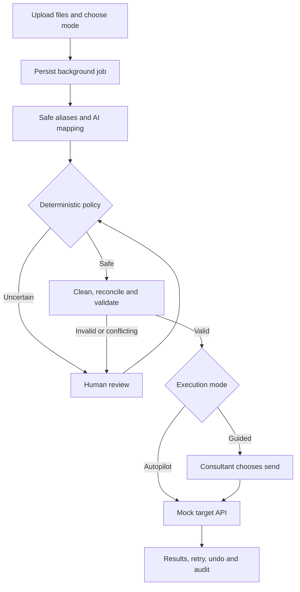

# MigrateFlow

**A supervised AI agent for employee data migration and integration**, built for the Darwinbox Forward Deployed Engineer assessment.

MigrateFlow combines inconsistent CSV and Excel exports into a validated employee dataset and sends it to a mock destination API. It handles high-confidence mappings and safe cleanup automatically, asks a consultant to resolve genuine uncertainty, and records decisions and delivery results.

## Submission package

This submission uses the **hosted prototype** route. Source: [migrateflow-fde-assessment](https://github.com/sudharshanreddyragipindi35-collab/migrateflow-fde-assessment). The live application URL is pending; localhost addresses below are development addresses, not hosted links. Repository access must be granted to reviewers while it is private.

- **Working prototype:** hosted application, with the sample-data walkthrough below for reviewers.
- **Source repository:** backend, frontend, tests, synthetic samples, configuration and setup instructions in this README.
- **One-page write-up:** [Approach, autonomy boundary and next steps](APPROACH.md), also available in [printable A4 format](docs/APPROACH_ONE_PAGE.html).

## Features

- Multi-file CSV/XLSX ingestion with different headers and formats.
- Safe alias recognition and open-source AI mapping for unfamiliar columns.
- Whitespace/casing/date cleanup, duplicate reconciliation and source provenance.
- Contextual review with approve, correct and reject controls.
- Persistent background execution, live progress and continuation after human decisions.
- Mock API delivery with per-record outcomes, idempotency, retry, batch-scoped undo and audit history.

## Tech stack

| Layer | Technologies | Purpose |
|---|---|---|
| Frontend | React, TypeScript, Vite | Consultant screens, progress, review and results |
| Backend | Python 3.12, FastAPI, Uvicorn, Pydantic | Typed APIs, validation and application services |
| Data processing | pandas, openpyxl, PyYAML | CSV/Excel parsing, profiling and target schema |
| AI mapping | Ollama, Qwen2.5 7B Instruct, LangChain Ollama adapter | Local open-source semantic mapping with structured responses |
| Persistence | SQLAlchemy, SQLite | Batches, mappings, workflow state, jobs, decisions and audit |
| Background execution | SQL job queue, Python worker threads | Atomic claims, renewable leases and review resumption |
| Integration/progress | HTTPX, FastAPI mock endpoints, Server-Sent Events | Target API calls and live events |
| Quality | pytest, Ruff, mypy, Vitest, Testing Library, ESLint, TypeScript | Regression tests, lint, type checks and build checks |
| Packaging | Docker, Docker Compose, Nginx, GitHub Actions configuration | Local deployment, frontend serving and CI checks |

Exact versions are in [backend/pyproject.toml](backend/pyproject.toml), [frontend/package.json](frontend/package.json) and the frontend lockfile.

Optional adapters include Anthropic and PostgreSQL. The recommended assessment setup uses **Ollama and SQLite**, with no paid model API key. LangGraph is included as a separately tested interrupt contract; the running application uses SQL-backed orchestration, not multiple independent model agents.

## Quick start: Docker and Ollama

Commands below use PowerShell from the repository root. Clone the submitted repository and enter its directory first, or open the extracted source directory.

```powershell
git clone https://github.com/sudharshanreddyragipindi35-collab/migrateflow-fde-assessment.git
Set-Location migrateflow-fde-assessment
```

### 1. Prerequisites

- Docker Desktop with Docker Compose, running with Linux containers.
- Ollama installed and running on the host computer.
- Git to clone the repository.
- Python 3.12 if running host-side smoke/test scripts; it is not needed just to start the Docker application.

Download the model:

```powershell
ollama pull qwen2.5:7b-instruct
ollama list
```

If Ollama is not already running, start `ollama serve` in a separate terminal. Compose starts the application, not Ollama. Initial dependency/image/model downloads require internet access and can take several minutes.

### 2. Create configuration

```powershell
if (-not (Test-Path .env)) { Copy-Item .env.example .env }
```

The example selects Ollama and the Qwen model. Keep credentials out of source control.

### 3. Build and start

```powershell
docker compose -f docker-compose.yml -f docker-compose.assessment.yml up -d --build
```

The assessment override selects Ollama, deterministic fallback, one concurrent model request and a 60-second request timeout. This is the configuration used for the recorded CPU model smoke test.

| Service | URL |
|---|---|
| Consultant UI | http://localhost:5173 |
| API documentation | http://localhost:8000/docs |
| API health | http://localhost:8000/health |
| Model configuration/readiness | http://localhost:8000/api/system/model |

The UI also displays model status. API health alone does not prove the model is reachable; check readiness and run the live smoke test below.

### 4. Inspect or stop

```powershell
docker compose -f docker-compose.yml -f docker-compose.assessment.yml logs --tail 100 backend
docker compose -f docker-compose.yml -f docker-compose.assessment.yml down
```

Named volumes retain the database and uploads after stopping. Do not remove volumes if you want to preserve migration history.

## Alternative: local development without Docker

Use Python **3.12 or 3.13**, Node.js **22**, npm and PowerShell. Install/start Ollama as above. From the repository root:

```powershell
python -m venv .venv
.\.venv\Scripts\Activate.ps1
.\scripts\setup.ps1
```

The setup script preserves an existing `.env`, installs backend development dependencies and runs `npm ci`. It does not start services or install Ollama.

For the CPU assessment settings, edit the root `.env`:

```dotenv
MODEL_MODE=ollama
LLM_FAILOVER_PROVIDER=fallback
LLM_REQUEST_TIMEOUT_SECONDS=60
LLM_PARALLEL_WORKERS=1
```

Start terminal 1 from the repository root:

```powershell
.\.venv\Scripts\Activate.ps1
Set-Location backend
python -m uvicorn app.main:app --reload --port 8000
```

Start terminal 2 from the repository root:

```powershell
Set-Location frontend
npm run dev -- --port 5173
```

Open http://localhost:5173. The frontend defaults to `http://localhost:8000`. For a different API address, set `VITE_API_BASE_URL` in the frontend process environment before starting/building. The backend reads the root `.env`; relative database/upload paths use its working directory, so consistently start native runs from `backend/`.

To explore without live inference, set `MODEL_MODE=fallback` and restart the backend. For Docker fallback mode, use the base Compose file alone because the assessment override forces Ollama. Fallback is labelled deterministic behavior and **does not prove live model execution**.

## Walk through a migration

1. Open **New Migration** and choose **Autopilot** or **Human-in-the-loop**.
2. Upload `sample_data/employees_india.csv`, `sample_data/employee_master.xlsx` and `sample_data/new_joiners.csv` together. Reserve `malformed.csv` for invalid-input demonstrations.
3. Autopilot begins background processing. In guided mode, start analysis using the UI controls.
4. Open **Review Queue** when help is requested. Inspect the reason and context, then approve a safe proposal, correct a value or reject a record. Enter known dates as `YYYY-MM-DD`; reject records whose required values cannot be established.
5. Inspect **Data Preview** for normalized values, validation status and provenance. Overlapping records such as `IN001` demonstrate reconciliation.
6. After outstanding decisions are resolved, Autopilot sends valid records automatically. Guided mode waits for the consultant to choose send.
7. Inspect **Integration Audit**, retry eligible failed records and use **Undo sent records** to demonstrate batch-scoped rollback.

For a deliberate transient failure, set `DEMO_FAILURES=true` in `.env` and recreate/restart the backend before a fresh migration. The sample `retry.noah@example.test` record supports the retry demonstration. Leave this setting `false` during normal operation.

See [DEMO_SCRIPT.md](DEMO_SCRIPT.md) for an optional walkthrough sequence. For this hosted submission, reviewers can exercise escalation and resolution directly in the live UI. The local instructions remain available for reproducibility.

## Architecture and autonomy



**The model proposes; application code controls execution.** Mapping confidence is an engineering score, not a calibrated probability. Automatic application requires confidence `>= 0.90`, compatible types and no blocking warnings. Lower confidence, collisions, ambiguous dates, identity conflicts and model-recovery warnings trigger review. Approval cannot bypass record validation.

Autopilot selection authorizes delivery to the mock destination at the start. Guided mode retains a separate send decision. Both enforce the same safety checks.

SQL persists workflow state and jobs. Two workers per process use atomic claims and renewable 60-second leases; final review resolution requeues work. Closing the browser does not stop server-side processing. Stage names describe responsibilities, not separate reasoning agents.

The connector uses HTTPX through the bundled mock API's ASGI transport by default. `MOCK_TARGET_BASE_URL` can select a compatible network stub. Delivery supports idempotency, per-record outcomes, bounded transient retries and batch-scoped undo.

## Configuration

Values below come from `.env.example`; the assessment override changes model timeout/concurrency as described above.

| Variable | Example/default | Purpose |
|---|---|---|
| `MODEL_MODE` | `ollama` | `ollama`, explicit `fallback`, or optional `anthropic` |
| `OLLAMA_MODEL` | `qwen2.5:7b-instruct` | Local model identifier |
| `OLLAMA_BASE_URL` | `http://localhost:11434` | Native Ollama endpoint |
| `OLLAMA_DOCKER_BASE_URL` | `http://host.docker.internal:11434` | Host Ollama endpoint from Compose |
| `LLM_FAILOVER_PROVIDER` | `fallback` | Recovery provider; retain this for the assessment |
| `LLM_REQUEST_TIMEOUT_SECONDS` | `30` | Model request timeout; assessment uses `60` |
| `LLM_PARALLEL_WORKERS` | `3` | Concurrent file requests; assessment uses `1` |
| `MAPPING_FAST_PATH` | `true` | Verified aliases bypass inference |
| `DATABASE_URL` | `sqlite:///./data/migrateflow.db` | Persistent application database |
| `UPLOAD_ROOT` | `./uploads` | Source-file storage |
| `MAX_UPLOAD_FILES` | `10` | Files per batch |
| `MAX_UPLOAD_BYTES` | `10485760` | Bytes per file (10 MB) |
| `MAX_SOURCE_ROWS` | `50000` | Rows per file |
| `MAX_SOURCE_COLUMNS` | `100` | Columns per file |
| `MOCK_TARGET_BASE_URL` | blank | Blank uses bundled in-process HTTP stub |
| `DEMO_FAILURES` | `false` | Deliberate retry demonstration |
| `CORS_ORIGINS` | `http://localhost:5173` | Allowed browser origin |
| `AUTO_CREATE_SCHEMA` | `true` | Local schema bootstrap |

Optional Anthropic support uses `ANTHROPIC_API_KEY` and `ANTHROPIC_MODEL`; leave the key blank for the assessment. Pooling settings apply to optional PostgreSQL. See [.env.example](.env.example) for the remaining settings.

## Tests and verification

Install development dependencies using local setup. From the repository root with the virtual environment activated:

```powershell
.\scripts\test.ps1
```

This runs backend Ruff/mypy/pytest, frontend ESLint/Vitest/TypeScript/Vite build, and deterministic evaluation. Tests use isolated temporary database/upload storage.

With the application and Ollama running:

```powershell
python scripts/smoke_test.py --live-model --timeout 180
```

The smoke creates synthetic data, validates and sends it to the mock destination, then undoes the writes. It requires an actual configured-provider proposal, so an all-alias or fallback run cannot count as live inference. Recognized aliases still use the normal fast path.

Other checks:

```powershell
python scripts/evaluate.py
python scripts/smoke_test.py
```

Recorded on 20 September 2026: **62 backend tests and 13 frontend tests passed**, together with lint, type and build checks. A live Ollama CPU smoke completed in **39.70 seconds**, with six alias mappings and one model mapping, followed by validation, delivery and undo. These are historical recorded results, not production accuracy or latency guarantees. See [Current validation](docs/CURRENT_VALIDATION.md) for evidence and outstanding checks.

## Repository structure

```text
backend/
  app/
    agent/          Policy, workflow state and background jobs
    api/            Upload, mapping, review, progress and target routes
    cleaning/       Normalization and reconciliation
    db/             SQLAlchemy persistence
    ingestion/      Parsing and profiling
    integration/    Target connector, retry and undo
    mapping/        Model adapters, evidence and schema
  tests/            Backend and regression tests
frontend/
  src/              React screens, components and API client
  tests/            UI component and integration tests
sample_data/        Synthetic CSV/XLSX inputs
target_schema/      Canonical employee YAML contract
scripts/            Setup, tests, evaluation and smoke helpers
evaluation/         Recorded evaluation/runtime evidence
docs/               Requirements, design, policy and verification
.github/            CI workflow configuration
```

The target contract is [target_schema/employee.yaml](target_schema/employee.yaml). Required fields include employee ID, first/last name, email, hire date, department and employment status. Optional fields include phone, birth date, manager ID and source system.

## Assessment coverage and documentation

| Acceptance criterion | Implementation |
|---|---|
| Multi-file ingestion | Heterogeneous exports, provenance and reconciliation |
| Autonomous mapping/cleanup | Safe aliases, model proposals and deterministic transformations |
| Defensible escalation | Confidence/type policy, ambiguity/collision checks and validation |
| Human supervision | Live progress, contextual decisions and continuation |
| Mock integration | Per-record API outcomes, idempotency, retry, undo and audit |
| Delta beyond AI | Code-owned authority, privacy, durable jobs, resource limits and regression evaluation |

- [Approach and autonomy decisions](APPROACH.md)
- [Functional/nonfunctional requirements and verification](docs/REQUIREMENTS_AND_VERIFICATION.md)
- [Current validation](docs/CURRENT_VALIDATION.md)
- [Autonomy policy](docs/AUTONOMY_POLICY.md)
- [High-level design](docs/HIGH_LEVEL_DESIGN.md) and [low-level design](docs/LOW_LEVEL_DESIGN.md)
- [Demo script](DEMO_SCRIPT.md) and [submission checklist](SUBMISSION_CHECKLIST.md)

Design documents include proposed production infrastructure. The requirements/verification document describes the current implementation boundary; enterprise diagrams and SLO targets are not proof of deployed production controls.

## Privacy, performance and limitations

Source values are masked in bounded model context. Structured response validation, collision checks and row validation retain authority. Excel archives have a 50 MB expanded-size budget in addition to upload limits.

Safe aliases avoid inference, unfamiliar fields are batched per file, and saved proposals are reused. Background work keeps interactions responsive, but CPU inference can take tens of seconds or longer. The small evaluation suite does not establish general accuracy or superiority over other systems.

This is a local assessment prototype. Authentication/RBAC, tenant isolation, encrypted storage, production migrations, distributed write fencing and managed observability remain future work. SQLite and the schema initializer suit local use. The PostgreSQL/Nginx scale example is not a production readiness guarantee.

Use synthetic data for evaluation. Never commit `.env`, credentials, real employee exports, uploads or local databases. Inspect staged files before publishing; ignore rules are not a substitute for review.

## Troubleshooting

| Symptom | Check |
|---|---|
| Model unavailable | Ollama is running, `ollama list` contains the model, and UI model status is ready. |
| Docker cannot reach Ollama | Verify the Docker endpoint and host service/firewall reachability. |
| Model is slow | Use the assessment profile and keep the alias fast path enabled; CPU inference takes longer than alias recognition. |
| Backend fails to start | Inspect logs, port 8000 availability and writable database/upload locations. |
| UI cannot reach API | Check health, `VITE_API_BASE_URL` and `CORS_ORIGINS`; restart/rebuild after Vite setting changes. |
| Native command missing | Activate `.venv`, verify installed prerequisites and rerun setup if needed. |
| Upload rejected | Use nonempty CSV/XLSX within configured file, row, column and archive limits. |
| Migration waiting | Resolve Review Queue decisions; guided mode also needs an explicit send action. |
| Record cannot be approved | Correct required values or reject it; validation cannot be bypassed. |
| Retry unavailable | Only eligible transient failures can be retried; undo disables retries for that batch. |

## Submission deliverables

Submit the hosted application URL, the destination Git repository with full source and this README, and the one-page [approach](APPROACH.md). Verify that the hosted application supports upload, an escalation resolved through the UI, continuation and target results. A recording is not planned for the selected hosted-link route. If switching to the local-run route, include the short demo recording specified by the assignment.
