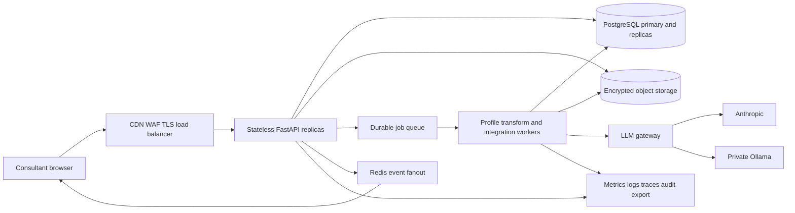
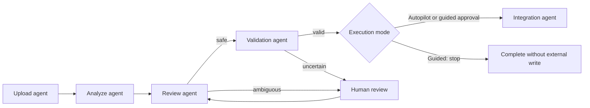

# MigrateFlow High Level Design

## Purpose and scale boundary

MigrateFlow is a supervised HR data migration service. The checked-in local profile is a single-node demonstration. The production design separates stateless request handling, durable state, asynchronous work, model calls, and file storage so replicas can be added safely. “2,000 users” and “10,000 users” are capacity planning tiers; they become guarantees only after workload-specific load, soak, failure, and recovery tests pass.

## Logical architecture

The current repository implements the API, UI, deterministic pipeline, durable workflow state, Ollama and Anthropic adapters, append-only audit records, and a mock target. PostgreSQL pooling, an Nginx edge example, and a scale compose profile are checked in. A SQL-backed job queue with renewable leases and two worker threads per process is now implemented. Object storage, a managed broker, Redis fanout, managed identity, and autoscaling are deployment capabilities in the production target and are not represented as completed runtime features.

## Specialized agent orchestration

The orchestration state is durable and mode-aware. Autopilot uses the permission established when the migration starts to advance all safe stages, including mock delivery. Human-in-the-loop retains the supervised five-screen flow and manual sending. Both modes enforce the same uncertainty and validation policy. A SQL job queue runs outside the HTTP request, with bounded workers and renewable leases.

## Request and work separation

Interactive endpoints validate input, persist intent, return a batch identifier, and stream bounded progress. CPU-heavy parsing, long transformations, external connector writes, and LLM calls belong in separately scaled workers. This keeps API latency predictable and makes backpressure explicit. Every queued command needs an idempotency key; retries use exponential backoff with jitter and terminate in a dead-letter queue.

## Availability and data design

- Run at least three API replicas across failure zones behind a health-aware load balancer.
- Use managed PostgreSQL with multi-zone failover, point-in-time recovery, tested backups, and connection pooling.
- Store uploads in private encrypted object storage using generated object keys and short-lived access.
- Keep API containers stateless. Session, workflow, event cursor, audit, and idempotency state must be shared.
- Apply schema migrations once as a deployment job before traffic shifts to the new release.
- Use rolling or blue-green deployment, readiness probes, graceful shutdown, and automatic rollback on SLO regression.

## Security boundaries

The edge terminates TLS, rate-limits abusive clients, and applies authentication and tenant authorization. Raw HR records stay in deterministic paths. Only bounded profiles with masked examples may reach a configured model. API keys come from a secret manager or local untracked `.env`; keys are never returned in errors or committed. Audit data uses separate retention and access controls from transient event streams.

## Reliability objectives

Initial production objectives are 99.9 percent monthly API availability, less than 1 percent server-error rate, p95 under 750 ms for non-model reads, durable acceptance of submitted jobs, and no cross-batch rollback. LLM latency is tracked separately because provider quotas and model latency are not controlled by the API tier.

## Deployment profiles

The local `docker-compose.yml` is for development. `docker-compose.production.yml` demonstrates same-origin routing, PostgreSQL, pool configuration, and horizontally replicated APIs on one host. A real multi-host deployment should translate the same boundaries to Kubernetes, ECS, Nomad, or an equivalent platform with managed database, queue, cache, and object storage services.
