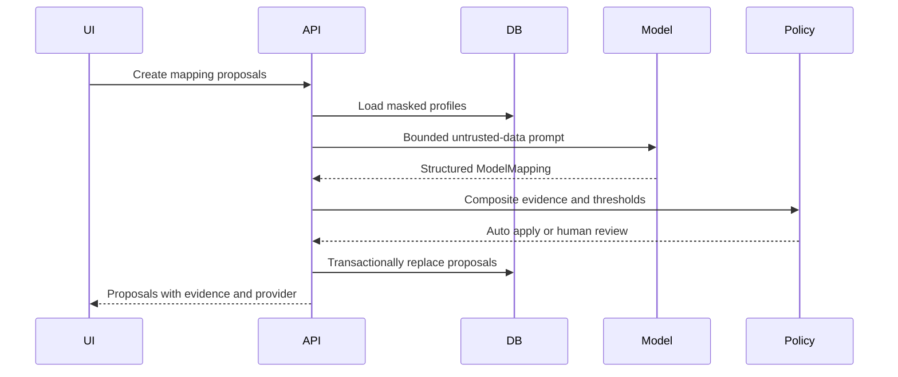

# MigrateFlow Low Level Design

## Backend modules

| Module | Responsibility | Scaling rule |
|---|---|---|
| `ingestion` | File validation, parsing, profiling, masked samples | Move parse work to workers; never parse unbounded files in API memory |
| `mapping` | Provider adapters, schema-constrained output, deterministic scoring | Limit model concurrency independently from API replicas |
| `agent` | SQL-backed workflow transitions plus a LangGraph contract for policy/interrupt topology | Keep one durable source of truth; use a shared checkpointer before any runtime LangGraph migration |
| `cleaning` and `validation` | Deterministic canonicalization and record rules | Pure, retryable, batch-partitioned work |
| `integration` | Idempotent writes, retry, compensation | Per-target rate limit and circuit breaker |
| `audit` and `events` | Immutable evidence and resumable progress | Database audit; Redis or broker fanout for multi-replica SSE |

## Model adapter contract

`MappingModel.propose(source_file, column, schema)` returns a validated `ModelMapping`. `OllamaMappingAdapter` and `AnthropicMappingAdapter` implement that contract. Both receive the same minimized prompt, use structured output, and fail closed. `DeterministicFallback` is explicit and labels its output; it never pretends to be a model.

Provider selection is controlled by `MODEL_MODE=ollama`, `anthropic`, or `fallback`. Anthropic mode requires a non-empty `ANTHROPIC_API_KEY`; startup of the adapter fails before a network call when the key is missing. Timeouts and retries are bounded through `LLM_REQUEST_TIMEOUT_SECONDS` and `LLM_MAX_RETRIES`.

## Mapping sequence

## Persistence and transactions

SQLite remains the convenient local store. Production uses `postgresql+psycopg` and the configured SQLAlchemy pool. Each request owns a short database session. Transactions must not remain open across model calls, file parsing, streaming, or connector calls. Unique idempotency keys protect target writes. The mock compensation marks only writes from the selected batch as rolled back; it retains audit evidence.

The local profile creates tables at startup. The production compose profile disables this in API replicas and runs one bootstrap job before they start, preventing concurrent DDL. A real rollout must replace that bootstrap with versioned migrations. PostgreSQL append-only audit protection should use restricted database roles plus triggers; the SQLite triggers remain a local safeguard.

## Failure states

- Invalid upload: reject before durable processing and return the consistent error envelope.
- Invalid model output: do not coerce it; mark retryable or require review according to policy.
- Model unavailable or quota limited: bounded retry, circuit breaker, and optional explicit fallback chosen by policy.
- Worker crash: message visibility timeout causes retry using the same idempotency key.
- Target partial failure: persist per-record outcome; retry only failed records.
- Lost client connection: work continues from durable state; SSE resumes from `Last-Event-ID`.

## Multi-replica requirements

Shared PostgreSQL is mandatory. Uploads move to object storage or a truly shared volume. SSE events use shared fanout rather than process memory. Readiness checks include dependencies required for the request type. Model and target integrations have separate concurrency semaphores so one slow dependency cannot exhaust all API workers.
