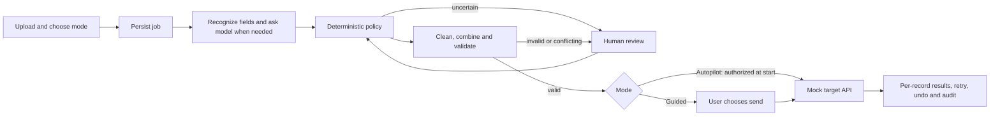

# Requirements and verification

This is a compact assessment prototype for employee migration, not a certified multi-tenant HR service. The assignment's six acceptance criteria define scope. The supplied FDE skill list informs engineering choices; RAG, MCP and multiple autonomous reasoning agents do not solve an additional requirement here.

## Functional requirements

| ID | Requirement | Implemented behavior | Evidence |
|---|---|---|---|
| FR1 | Combine heterogeneous exports | Multiple CSV/XLSX files in one batch; schema profiles, safe header handling, source provenance, duplicate merge and conflict review | ingestion, cleaning and end-to-end tests |
| FR2 | Map without field-by-field instructions | Verified aliases use deterministic evidence; unfamiliar columns use structured open-source Ollama proposals; collisions never overwrite | mapping and submission regression tests |
| FR3 | Clean safely | Whitespace, Unicode, known enum casing, names, email, phone, typed Excel dates and dates with only one interpretation; preserve uncertain values | cleaning tests and evaluation date cases |
| FR4 | Escalate genuine uncertainty | Confidence/type policy, ambiguous dates, low-confidence mappings, invalid required values and conflicting identities; no invalid-record approval | workflow/policy/regression tests |
| FR5 | Supervise in plain language | Live stages, masked source examples, explanations, comparison of conflicting values, approve/correct/reject, understandable preview and results | React component tests; visual walkthrough still required |
| FR6 | Autonomous execution | Selecting Autopilot authorizes automatic mock-target writes. Upload queues the work; final review resolution requeues it. Guided mode retains manual sending | background completion and resume tests |
| FR7 | Mock API integration | Connector sends an HTTP request through the stub's ASGI API; optional network base URL; per-record status, same-key replay and changed-payload rejection | integration/regression tests |
| FR8 | Retry and compensate | Retry only transient failures, bounded counts, accurate partial failure status, batch-scoped undo, no retry after undo | integration and regression tests |
| FR9 | Audit and continuity | Persistent decisions/provenance/events; refresh does not discard work; rejected/corrected records survive repeat transform | workflow, audit, regression tests |
| FR10 | Delta solutioning | Execution policy, validation, duplicate protection, resource budgets, privacy, recovery and measurable evaluation are code-owned | relevant modules and tests |

## Non-functional requirements

| ID | Requirement | Current implementation and limit |
|---|---|---|
| NFR1 | Responsive user interaction | Model processing runs outside the upload request. POST pipeline/run returns 202. Two background workers per process; a test checks a small fallback upload responds within 3 seconds. Actual Ollama latency depends on hardware. |
| NFR2 | Efficient model use | Exact safe aliases bypass inference; remaining fields are batched per file. Persisted proposals are reused on replay. A regression proves only the unfamiliar column is sent from a three-column profile. This is not a claim of speed superiority over other products. |
| NFR3 | Correctness over confidence claims | Model output is schema validated, named responses are checked for missing/duplicate/unknown columns, deterministic confidence and collision checks retain authority. Every row is validated before sending. |
| NFR4 | Durable work and recovery | SQL job table, atomic claims, renewable 60-second leases, generation-based requeue and isolated worker sessions. An expired lease can be reclaimed. Validate deployment-specific failover before multi-host use. |
| NFR5 | Bounded resource use | 10 uploads, 10 MB each, 50,000 rows and 100 columns per file, 50 MB expanded XLSX budget, bounded model timeouts/recovery and worker concurrency. Large migrations need streaming/object storage. |
| NFR6 | Privacy | Arbitrary cell values, including names and numbers, are masked before model context; type/date statistics remain. Injection-like text is redacted. Raw source data stays in local uploads and preview. Uploaded HR data and audit files still require encrypted storage in production. |
| NFR7 | Consistent authority | Public target write routes reject unresolved reviews and stopped/undone batches; mapping collisions cannot be approved into an overwrite; invalid record approval is prohibited. This is workflow authority, not identity authentication. |
| NFR8 | Observable operation | Persisted SSE events with resume IDs, correlation IDs, audit export, per-record target results and clear partial failure states. SSE releases database connections between polls. |
| NFR9 | Reproducible quality | Isolated temporary test database/uploads, lint/types/tests/build, adversarial evaluation checks and GitHub Actions workflow. CI configuration is included; no remote CI run is claimed. |
| NFR10 | Usability/accessibility | Labelled inputs, keyboard-native controls, status/error announcements, disabled duplicate submissions, useful recovery text and readable records. Browser automation was unavailable in this session, so no accessibility certification or visual sign-off is claimed. |

## Execution and authority

The runtime is a bounded AI workflow with a SQL state machine. Stage labels describe responsibilities; they are not independent model agents. LangGraph remains a separately tested interrupt contract. A replacement runtime should use one state authority, not two competing checkpoint systems.

## Explicit production follow-ups

Authentication, RBAC and tenant boundaries; encryption/key management; production schema migrations; shared object storage; global inference quotas; fenced distributed writes and failure testing; target-specific credentials/rate limiting; metrics/tracing backend; larger client-representative and live-model evaluation. PostgreSQL/Nginx Compose is a scale example, not evidence of all these controls being complete.

## Submission completion

Run all local quality gates, then demonstrate a real Ollama mapping for an unfamiliar field, one UI escalation resolved, automatic continuation, retry and undo. Attach the required short recording when submitting local run instructions. Keep APPROACH.md within one rendered page. Include new source files in Git, excluding local uploads, databases, credentials and temporary probes.
